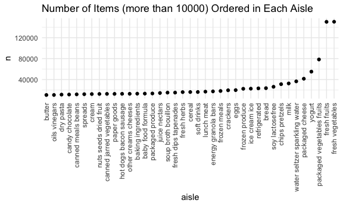
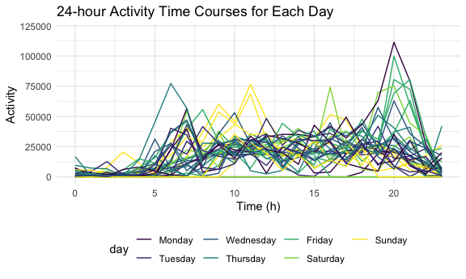

p8105\_hw3\_yf2563
================
Yatong Feng
10/9/2020

``` r
library(tidyverse)
library(p8105.datasets)

knitr::opts_chunk$set(
    fig.width = 6, 
  fig.asp = .6,
  out.width = "90%"
)

theme_set(theme_minimal() + theme(legend.position = "bottom"))

options(
  ggplot2.continuous.colour = "viridis",
  ggplot2.continuous.fill = "viridis"
)

scale_colour_discrete = scale_colour_viridis_d
scale_fill_discrete = scale_fill_viridis_d
```

## Problem 1

``` r
data("instacart")
instacart
```

    ## # A tibble: 1,384,617 x 15
    ##    order_id product_id add_to_cart_ord… reordered user_id eval_set order_number
    ##       <int>      <int>            <int>     <int>   <int> <chr>           <int>
    ##  1        1      49302                1         1  112108 train               4
    ##  2        1      11109                2         1  112108 train               4
    ##  3        1      10246                3         0  112108 train               4
    ##  4        1      49683                4         0  112108 train               4
    ##  5        1      43633                5         1  112108 train               4
    ##  6        1      13176                6         0  112108 train               4
    ##  7        1      47209                7         0  112108 train               4
    ##  8        1      22035                8         1  112108 train               4
    ##  9       36      39612                1         0   79431 train              23
    ## 10       36      19660                2         1   79431 train              23
    ## # … with 1,384,607 more rows, and 8 more variables: order_dow <int>,
    ## #   order_hour_of_day <int>, days_since_prior_order <int>, product_name <chr>,
    ## #   aisle_id <int>, department_id <int>, aisle <chr>, department <chr>

**Short description:**  
This dataset contains 1384617 rows and 15 columns.

Observations are the level of items in orders by user. There are user /
order variables – user ID, order ID, order day, and order hour. There
are also item variables – name, aisle, department, and some numeric
codes.

**Questions:**

#### 1.1. How many aisles are there, and which aisles are the most items ordered from?

``` r
instacart %>% 
    count(aisle) %>% 
    arrange(desc(n))
```

    ## # A tibble: 134 x 2
    ##    aisle                              n
    ##    <chr>                          <int>
    ##  1 fresh vegetables              150609
    ##  2 fresh fruits                  150473
    ##  3 packaged vegetables fruits     78493
    ##  4 yogurt                         55240
    ##  5 packaged cheese                41699
    ##  6 water seltzer sparkling water  36617
    ##  7 milk                           32644
    ##  8 chips pretzels                 31269
    ##  9 soy lactosefree                26240
    ## 10 bread                          23635
    ## # … with 124 more rows

There are 134 aisles, and fresh vegetables is the most items ordered
from

#### 1.2. Make a plot that shows the number of items ordered in each aisle

  - limiting this to aisles with more than 10000 items ordered.
  - Arrange aisles sensibly, and organize your plot so others can read
    it.

<!-- end list -->

``` r
instacart %>% 
    count(aisle) %>% 
    filter(n > 10000) %>% 
    mutate(
        aisle = factor(aisle),
        aisle = fct_reorder(aisle, n)
    ) %>% 
    ggplot(aes(x = aisle, y = n)) + 
    geom_point() + 
  labs(
    title = "Number of Items (more than 10000) Ordered in Each Aisle"
  ) +
    theme(axis.text.x = element_text(angle = 90, vjust = 0.5, hjust = 1))
```



#### 1.3. Make a table showing the three most popular items in each of the aisles “baking ingredients”, “dog food care”, and “packaged vegetables fruits”. Include the number of times each item is ordered in your table.

``` r
instacart %>% 
    filter(aisle %in% c("baking ingredients", "dog food care", "packaged vegetables fruits")) %>% 
    group_by(aisle) %>% 
    count(product_name) %>% 
    mutate(rank = min_rank(desc(n))) %>% 
    filter(rank < 4) %>% 
    arrange(aisle, rank) %>% 
  knitr::kable()
```

| aisle                      | product\_name                                 |    n | rank |
| :------------------------- | :-------------------------------------------- | ---: | ---: |
| baking ingredients         | Light Brown Sugar                             |  499 |    1 |
| baking ingredients         | Pure Baking Soda                              |  387 |    2 |
| baking ingredients         | Cane Sugar                                    |  336 |    3 |
| dog food care              | Snack Sticks Chicken & Rice Recipe Dog Treats |   30 |    1 |
| dog food care              | Organix Chicken & Brown Rice Recipe           |   28 |    2 |
| dog food care              | Small Dog Biscuits                            |   26 |    3 |
| packaged vegetables fruits | Organic Baby Spinach                          | 9784 |    1 |
| packaged vegetables fruits | Organic Raspberries                           | 5546 |    2 |
| packaged vegetables fruits | Organic Blueberries                           | 4966 |    3 |

**4. Make a table showing the mean hour of the day at which Pink Lady
Apples and Coffee Ice Cream are ordered on each day of the week; format
this table for human readers (i.e. produce a 2 x 7 table).**

``` r
instacart %>% 
    filter(product_name %in% c("Pink Lady Apples", "Coffee Ice Cream")) %>% 
    group_by(product_name, order_dow) %>% 
    summarize(mean_hour = mean(order_hour_of_day)) %>% 
    pivot_wider(
        names_from = order_dow,
        values_from = mean_hour
    )
```

    ## # A tibble: 2 x 8
    ## # Groups:   product_name [2]
    ##   product_name       `0`   `1`   `2`   `3`   `4`   `5`   `6`
    ##   <chr>            <dbl> <dbl> <dbl> <dbl> <dbl> <dbl> <dbl>
    ## 1 Coffee Ice Cream  13.8  14.3  15.4  15.3  15.2  12.3  13.8
    ## 2 Pink Lady Apples  13.4  11.4  11.7  14.2  11.6  12.8  11.9

## Problem 2

#### 2.0. Description of the dataset

This problem uses five weeks of accelerometer data collected on a 63
year-old male with BMI 25, who was admitted to the Advanced Cardiac Care
Center of Columbia University Medical Center and diagnosed with
congestive heart failure (CHF). In this spreadsheet, variables
activity.\* are the activity counts for each minute of a 24-hour day
starting at midnight.

#### 2.1. Load, tidy, and otherwise wrangle the data.

  - include all originally observed variables and values; have useful
    variable names;
  - include a weekday vs weekend variable;
  - encode data with reasonable variable classes.

<!-- end list -->

``` r
accel_data_path = './data/accel_data.csv'

accel_data = 
  read_csv(accel_data_path) %>%
  janitor::clean_names() %>%
  mutate(
    weekday = case_when(
    day == "Saturday" ~ "weekend",
    day == "Sunday"   ~ "weekend",
    TRUE              ~ "weekday"
    )
  ) %>%
  pivot_longer(
    activity_1:activity_1440,
    names_to = "minute",
    names_prefix = "activity_",
    values_to = "accel") %>%
  mutate(minute = as.numeric(minute)) %>%
  rename("week_id" = week)
```

    ## Parsed with column specification:
    ## cols(
    ##   .default = col_double(),
    ##   day = col_character()
    ## )

    ## See spec(...) for full column specifications.

``` r
accel_data
```

    ## # A tibble: 50,400 x 6
    ##    week_id day_id day    weekday minute accel
    ##      <dbl>  <dbl> <chr>  <chr>    <dbl> <dbl>
    ##  1       1      1 Friday weekday      1  88.4
    ##  2       1      1 Friday weekday      2  82.2
    ##  3       1      1 Friday weekday      3  64.4
    ##  4       1      1 Friday weekday      4  70.0
    ##  5       1      1 Friday weekday      5  75.0
    ##  6       1      1 Friday weekday      6  66.3
    ##  7       1      1 Friday weekday      7  53.8
    ##  8       1      1 Friday weekday      8  47.8
    ##  9       1      1 Friday weekday      9  55.5
    ## 10       1      1 Friday weekday     10  43.0
    ## # … with 50,390 more rows

  - Describe the resulting dataset (e.g. what variables exist, how many
    observations, etc).

<!-- end list -->

``` r
summary(accel_data)
```

    ##     week_id      day_id       day              weekday         
    ##  Min.   :1   Min.   : 1   Length:50400       Length:50400      
    ##  1st Qu.:2   1st Qu.: 9   Class :character   Class :character  
    ##  Median :3   Median :18   Mode  :character   Mode  :character  
    ##  Mean   :3   Mean   :18                                        
    ##  3rd Qu.:4   3rd Qu.:27                                        
    ##  Max.   :5   Max.   :35                                        
    ##      minute           accel     
    ##  Min.   :   1.0   Min.   :   1  
    ##  1st Qu.: 360.8   1st Qu.:   1  
    ##  Median : 720.5   Median :  74  
    ##  Mean   : 720.5   Mean   : 267  
    ##  3rd Qu.:1080.2   3rd Qu.: 364  
    ##  Max.   :1440.0   Max.   :8982

Description: The dimension of this resulting dataset is 50400, 6, which
means that, there are 50400 observations and 6 variables. The variables
include accel, day, day\_id, minute, week\_id, weekday. `week_id`
includes numbers ranging from 1 to 5, and `day_id` includes numbers
ranging from 1 to 35 (each day in 5 weeks). `weekday` is weekday vs
weekend variable. `minute` includes numbers ranging from 1 to 1440,
which represents the original activity\_1:activity\_1440 (each minute of
a 24-hour day starting at midnight).

#### 2.2. Make a table

Traditional analyses of accelerometer data focus on the total activity
over the day.

  - aggregate accross minutes to create a total activity variable for
    each day
  - Are any trends apparent?

<!-- end list -->

``` r
accel_table = 
  accel_data %>%
  mutate(day = forcats::
           fct_relevel(day, c("Monday", "Tuesday", "Wednesday", 
                              "Thursday", "Friday", "Saturday", "Sunday"))) %>% 
  group_by(week_id, day) %>%
  summarise(total_counts = sum(accel)) %>%
  pivot_wider(names_from = week_id,
              names_prefix = "week_",
              values_from = total_counts) %>% 
  knitr::kable(digits = 1)
```

    ## `summarise()` regrouping output by 'week_id' (override with `.groups` argument)

``` r
accel_table
```

| day       |  week\_1 | week\_2 | week\_3 | week\_4 | week\_5 |
| :-------- | -------: | ------: | ------: | ------: | ------: |
| Monday    |  78828.1 |  295431 |  685910 |  409450 |  389080 |
| Tuesday   | 307094.2 |  423245 |  381507 |  319568 |  367824 |
| Wednesday | 340115.0 |  440962 |  468869 |  434460 |  445366 |
| Thursday  | 355923.6 |  474048 |  371230 |  340291 |  549658 |
| Friday    | 480542.6 |  568839 |  467420 |  154049 |  620860 |
| Saturday  | 376254.0 |  607175 |  382928 |    1440 |    1440 |
| Sunday    | 631105.0 |  422018 |  467052 |  260617 |  138421 |

Trends: There is no obvious trend presents in the table. Besides, Monday
of week 1 and Saturday of Week 4 and 5 have obvious lower value.

#### 2.3. Make a plot

Accelerometer data allows the inspection activity over the course of the
day.

  - Make a single-panel plot that shows the 24-hour activity time
    courses for each day
  - use color to indicate day of the week
  - Describe in words any patterns or conclusions you can make based on
    this graph.

<!-- end list -->

``` r
accel_plot_data = 
  accel_data %>%
  mutate(day = forcats::
           fct_relevel(day, c("Monday", "Tuesday", "Wednesday", 
                              "Thursday", "Friday", "Saturday", "Sunday"))) %>%
  mutate(hour = (minute - 1) %/% 60) %>% 
  group_by(day_id, hour,day) %>%
  summarise(total_hour_accel = sum(accel))
```

    ## `summarise()` regrouping output by 'day_id', 'hour' (override with `.groups` argument)

``` r
accel_plot_data
```

    ## # A tibble: 840 x 4
    ## # Groups:   day_id, hour [840]
    ##    day_id  hour day    total_hour_accel
    ##     <dbl> <dbl> <fct>             <dbl>
    ##  1      1     0 Friday            2397.
    ##  2      1     1 Friday            2215.
    ##  3      1     2 Friday            1509.
    ##  4      1     3 Friday            3163.
    ##  5      1     4 Friday            4598.
    ##  6      1     5 Friday            7190.
    ##  7      1     6 Friday           11713.
    ##  8      1     7 Friday           16275.
    ##  9      1     8 Friday           17261.
    ## 10      1     9 Friday           37520.
    ## # … with 830 more rows

``` r
accel_plot_data%>%
  ggplot(aes(x = hour, y = total_hour_accel, group = day_id)) +
  geom_line(aes(colour=day)) +
  labs(title = "24-hour Activity Time Courses for Each Day") + 
  xlab("Time (h)") + 
  ylab("Activity") +
  ylim(0,120000)
```



Describe: In the plot of 24-hour activity time courses, during 00:00 to
05:00, the activity in all days are relatively low. After 05:00, the
data fluctuates. At around 11:00, the activity in Sundays is relatively
higher.

## Problem 3

#### 3.1. Load data

  - write a short description of the dataset
  - noting the size and structure of the data
  - describing some key variables
  - indicating the extent to which missing data is an issue.

<!-- end list -->

``` r
data("ny_noaa")
ny_noaa
```

    ## # A tibble: 2,595,176 x 7
    ##    id          date        prcp  snow  snwd tmax  tmin 
    ##    <chr>       <date>     <int> <int> <int> <chr> <chr>
    ##  1 US1NYAB0001 2007-11-01    NA    NA    NA <NA>  <NA> 
    ##  2 US1NYAB0001 2007-11-02    NA    NA    NA <NA>  <NA> 
    ##  3 US1NYAB0001 2007-11-03    NA    NA    NA <NA>  <NA> 
    ##  4 US1NYAB0001 2007-11-04    NA    NA    NA <NA>  <NA> 
    ##  5 US1NYAB0001 2007-11-05    NA    NA    NA <NA>  <NA> 
    ##  6 US1NYAB0001 2007-11-06    NA    NA    NA <NA>  <NA> 
    ##  7 US1NYAB0001 2007-11-07    NA    NA    NA <NA>  <NA> 
    ##  8 US1NYAB0001 2007-11-08    NA    NA    NA <NA>  <NA> 
    ##  9 US1NYAB0001 2007-11-09    NA    NA    NA <NA>  <NA> 
    ## 10 US1NYAB0001 2007-11-10    NA    NA    NA <NA>  <NA> 
    ## # … with 2,595,166 more rows

#### 3.2. data cleaning.

  - Create separate variables for year, month, and day.
  - Ensure observations for temperature, precipitation, and snowfall are
    given in reasonable units.
  - For snowfall, what are the most commonly observed values? Why?

#### 3.3. Make a plot

  - Make a two-panel plot showing the average max temperature in January
    and in July in each station across years.
  - Is there any observable / interpretable structure? Any outliers?

#### 3.4. Make a plot

  - 1)  tmax vs tmin for the full dataset (not scatterplot)

  - 2)  make a plot showing the distribution of snowfall values greater
        than 0 and less than 100 separately by year.

  - commenting on the results
